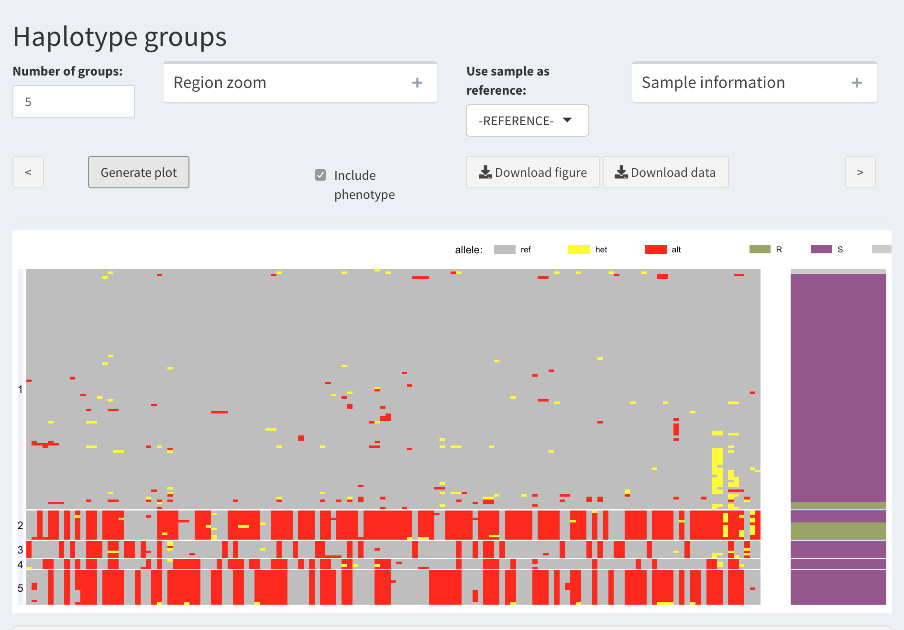
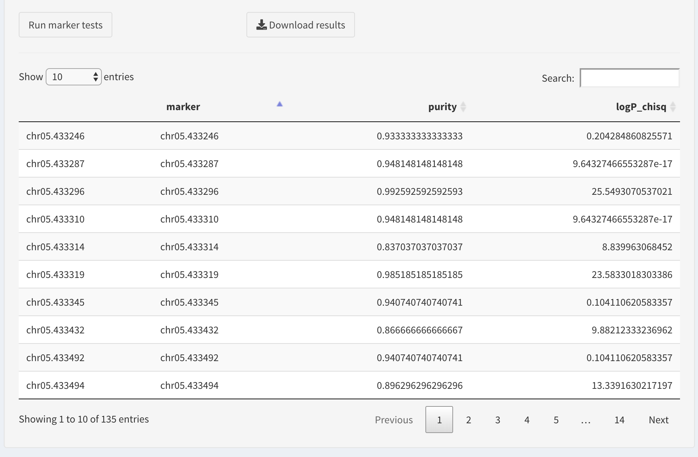
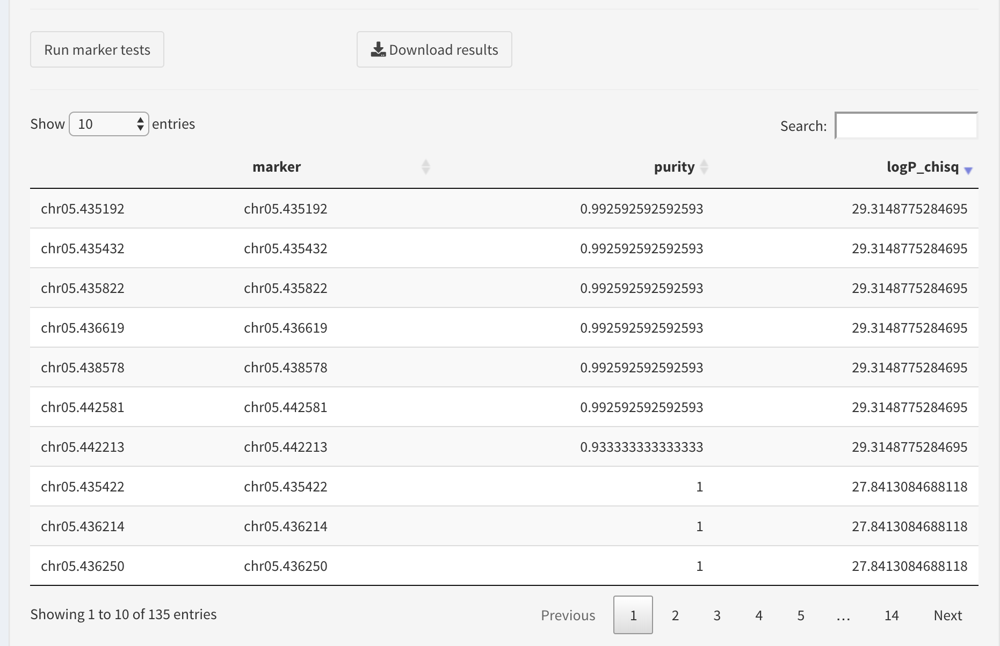

.. |proj|  replace:: HaploTool
.. _proj: http://gobii-marker-tools-portal

Analysis
===========

The "Analysis" tab is the main area of the tool.

Here you can do the following:

- Group the individuals into "haplotype clusters" and visualize all genotypes(
  along with phenotype, if given). 
  Various options can be applied, see below).

- Assign categories to the haplotype groups and find markers 
  that best capture these categories

Haplotype grouping
-----

The main haplotype group visualization is created by clicking  "*Generate plot*".

Example:

.. image :: images/analysis/haplo-groups-xa5.png
   :alt: Haplotype groups
   :scale: 50%

In this graph, the individual genotypes are represented as follows:

- columns are SNPs

- rows are individuals (samples)

- each rectangle represents genotype using color ( grey: refrence ; yellow: heterozygous; red: homozygous variant; white: missing)

- the samples are clustered into groups by hierarchical clustering ; the group numbers appear on the right.

**Options**

- Number of groups. 

  This text field is for user to specify the number of groups.
  Note that the individuals are clustered using hierarchical clustering. The resulting tree is cut at the level corresponding to specified number of groups.

- Include phenotype.
  
  When phenotype is available, visualize the phenotype values along with corresponding genotype data. Currently, phenotype values are represented by color.

- Use sample as reference.
  
  User can specify an individual (sample) within the dataset to be used as a "reference" for visualization purposes. In this case, the alleles in other samples that are variant with respect to this new reference will be colored red, etc. 

**Other outputs**

Below the main graph, there are two tables

* Group info

  This tables shows the number of samples classified into each haplotype group.

  It has other purpose as well: to assign a "trait category" to each group. (More on this in "Marker validation" subpage).

* Sample info

  This table shows which group each sample belongs to. 
  
  To find a particular sample, it is probably easiest to enter the sample ID in the search field.

Marker validation
-----------------

After visualizing a genomic region believed to be associated with a trait, along with the phenotype, one may want to see if a particular haplotype groups are associated with the trait and represent a "favourable haplotype",
and whether there are variants in this region  that tag the favourable haplotype and may be used as trait markers.

One may also have a trait marker ready and would like to confirm that the marker indeed tags the favourable haplotype.
and by adding it to the dataset 

|proj| can help here by letting the user define haplotype groups as favourable (R) or unfavourable (S), and run association test for each marker. Using the resulting table, the researcher may gauge whether trait marker is indeed associated with the selected favourable haplotype.

Let's proceed with an example. Using the above funcitons we visualized a  region associated with a resistant/susceptible phenotype.

Based on this, one can argue that Group 2 represents the resistant phenotype. Thus, we are interested in the SNPs that can tag this haplotype as best as possible. 

We proceed with assigning a "trait category" (R or S) to each haplotype group

.. image::images/analysis/group-trait-category.png 

Here is an example result table:

If the dataset contains trait markers, one can search for those by entering the positino in the search box,

Otherwise, we will find the best markers by sorting the table. Wwe prefer the markers that have high values of association statistics (here these are log-transformed p-values of chi-squared association test).

The table columns are sortable, so we will sort the log chi squared column to sort the table.

The user can download the results table as a CSV file by clicking "Download results" button.

